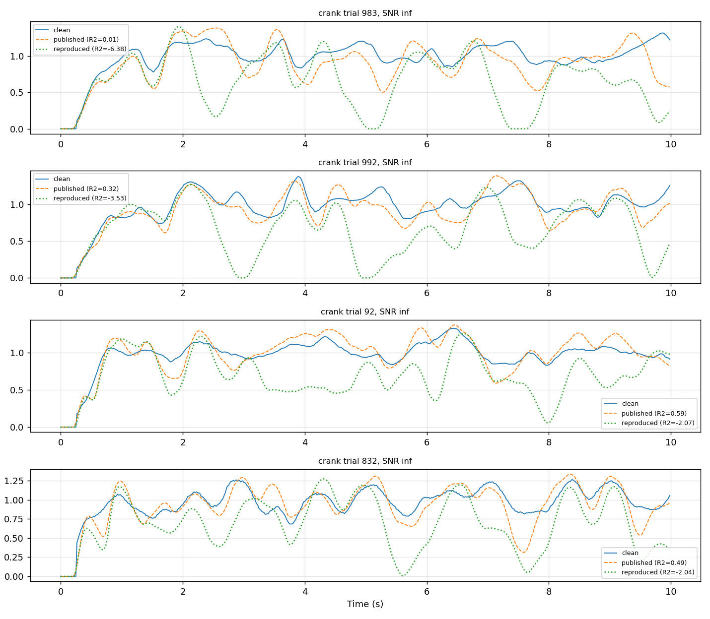

# Reproducing the released checkpoints

Can the two checkpoints in `checkpoints/` be reproduced from the configs in this
repository? This records the attempt, the evidence, and what did not match.

**Conclusion: both released checkpoints reproduce.** The residual differences are
the size of run-to-run variance. One dataset-specific discrepancy in the
*pretrained* checkpoint is characterised below; it does not survive fine-tuning.

## The artefacts under test

| Checkpoint | Stage | Config | Originating wandb run |
|---|---|---|---|
| `config-0423-ModGaussian_ampl_24.pth` | 1, pretraining | `config-0423-ModGaussian_ampl.yaml` | `bxkweckh` |
| `config-0425-tune_ModGauss_wo_writing_9.pth` | 2, fine-tuning | `config-0425-tune_ModGauss_wo_writing.yaml` | `jbj4im5v` |

**Provenance caveat.** `bxkweckh` is named *"DISCONNECTED BUT RUN WELL"* and is in
state `crashed` with only 8176 steps logged — about 8 of its 25 epochs. Training
continued after wandb logging stopped (checkpoint `_24.pth` was written 93 minutes
after the run started, consistent with the logged step rate), but **the wandb run
page does not contain the epochs that produced the released weights.** The full
history is in the training log alongside the checkpoint. `jbj4im5v` by contrast
finished cleanly with all 10000 steps.

## Method

Two independent lines of evidence:

1. **Trajectory** — compare per-epoch training metrics against the published run
   (`scripts/colab/wandb_compare_runs.py`). Catches divergence early and does not
   depend on the evaluation code.
2. **Behaviour** — re-evaluate the finished checkpoints on identical data
   (`scripts/colab/compare_checkpoints.py`). Paired: the RNGs are reseeded
   identically per checkpoint, so both see the same trials, the same organic
   subsample and the same noise. Without that, differences of the size we are
   looking for are indistinguishable from sampling variance.

Replicates with `--seed-offset` establish run-to-run variance, which is what makes
any observed gap interpretable. Note that changing `seed` in the YAML does *not*
work: `train()` sets `dataset.seed = epoch`, so `config.seed` never reaches the
data stream, and with `dropout_rate: 0` two runs of a fine-tuning config are
bit-identical.

## Runs

| Label | Stage | Base weights | Seed offset | Status |
|---|---|---|---|---|
| stage-1 rerun | 1 | from scratch | 0 | complete, 25 epochs |
| stage-1 replicate | 1 | from scratch | 1000 | complete, 25 epochs |
| A | 2 | published `_24` | 0 | complete |
| B | 2 | reproduced `_24` | 0 | complete |
| A2 | 2 | published `_24` | 1000 | complete |
| B2 | 2 | reproduced `_24` | 1000 | complete |

All six ran on Colab (L4 and T4) via `scripts/train.py` under
`scripts/colab/supervise.py`. Four VMs were reclaimed mid-run; each was resumed
from its last checkpoint with `--resume`, which is why some runs span two wandb
entries.

## Result: stage 1 reproduces

Synthetic evaluation with known ground truth, averaged over 9 noise × refractory
conditions, published checkpoint versus reproduction:

| Metric | Published | Reproduced | Δ |
|---|---:|---:|---:|
| Onset F1 | 0.8459 | 0.8497 | +0.0038 |
| Onset precision | 0.8035 | 0.8099 | +0.0064 |
| Onset recall | 0.8962 | 0.8962 | −0.0000 |
| Onset distance (samples) | 0.8238 | 0.8222 | −0.0016 |
| Reconstruction R² | 0.9842 | 0.9864 | +0.0023 |
| Amplitude R² | 0.8422 | 0.8400 | −0.0021 |
| Duration R² | 0.8143 | 0.8136 | −0.0007 |

The training trajectory agrees too: against the 8 epochs `bxkweckh` did log,
per-epoch onset precision differs by at most 0.006 after epoch 0, and detection
loss by at most 0.008.

### One discrepancy: crank at SNR ∞

Across all 24 organic dataset × noise cells, exactly one exceeds |ΔR²| = 0.02:

| | Published | Reproduced | Δ |
|---|---:|---:|---:|
| **crank, SNR ∞** | 0.6592 | 0.1990 | **−0.4603** |
| crank, SNR 20 | 0.6558 | 0.6312 | −0.0246 |
| crank, SNR 10 | 0.5853 | 0.5429 | −0.0424 |

Everything else sits within ±0.016. The gap is not sampling noise: at SNR ∞ no
noise is added and the trial subsample was seeded identically, so both models saw
identical input. The reproduction under-detects there (5.04 → 4.42 submovements/s).

**Per-trial diagnosis** (`scripts/colab/diagnose_dataset.py`, 64 trials) shows this
is not a uniform degradation but a small number of catastrophic failures:

| | Published | Reproduced |
|---|---:|---:|
| R² mean | 0.665 | 0.222 |
| R² median | 0.735 | 0.622 |
| R² min | −0.006 | −6.38 |
| trials with R² < 0 | 1.6% | 17.2% |

The median falls only 0.11; the 10 worst trials account for **78%** of the total
negative delta, and 12 of 64 are worse by more than 0.5.



The mechanism is visible in those trials: crank is continuous rotation, so the
clean signal is a sustained level with small ripples. The reproduced model
intermittently **stops emitting onsets** across such stretches, and because the
reconstruction is a sum of bells anchored at detected onsets, it collapses toward
zero in the gaps and recovers afterwards. That is detection dropout, not an
amplitude error, and it matches the lower detection rate (5.04 → 4.42
submovements/s).

Why it appears only at SNR ∞ is consistent with extrapolation: training samples
SNR from [10, 50], so a perfectly noiseless input is outside the training
distribution, and crank is the smoothest signal in the set. Adding mild noise
restores near-parity. This remains a hypothesis about the cause; the failure mode
itself is established.

### Putting the discrepancy in scale: a seed replicate

A second pretraining run differing only by `--seed-offset 1000` settles whether
the gap is meaningful. Synthetic metrics, mean absolute difference over the seven
ground-truth measures:

| Pair | mean \|Δ\| | max \|Δ\| |
|---|---:|---:|
| published vs rerun | **0.0024** | 0.0064 |
| published vs replicate | 0.0038 | 0.0084 |
| rerun vs replicate (seed only) | **0.0029** | 0.0082 |

**The distance from the published checkpoint to a reproduction is no larger than
the distance between two reproductions that differ only by seed.** On the measure
pretraining actually optimises, reproduction succeeds.

Crank remains the exception, and it is systematic rather than a fluke — both
reproductions under-detect there, and crank is the *only* dataset beyond
|ΔR²| = 0.02 for either (3 cells each, one per noise level):

| crank R² | Published | Rerun | Replicate |
|---|---:|---:|---:|
| SNR ∞ | 0.6592 | 0.1990 | 0.5875 |
| SNR 20 | 0.6558 | 0.6312 | 0.6318 |
| SNR 10 | 0.5853 | 0.5429 | 0.4864 |
| submovements/s at SNR ∞ | 5.04 | 4.42 | 4.51 |

So the noiseless-crank cell is both **systematically biased** (both reproductions
detect ~11% fewer submovements than the published checkpoint) and **extremely
high-variance** (−0.07 versus −0.46 between two seeds). That combination is what
you expect from an out-of-distribution operating point where a few trials tip
into catastrophic detection dropout: the direction is reproducible, the magnitude
is not. The released checkpoint sits on the fortunate side of it.

## Result: stage 2 reproduces

Run A (fine-tuned from the released pretrained checkpoint, as the config
specifies) against the released fine-tuned checkpoint.

**Trajectory.** Against the published run `jbj4im5v`, epoch-aligned by step:
onset precision differs by at most 0.0055, recall by 0.0095, detection loss by
0.0095, at every comparable epoch.

**Behaviour.** Synthetic evaluation, mean over 9 noise × refractory conditions:

| Metric | Released | Reproduced | Δ |
|---|---:|---:|---:|
| Onset precision | 0.8116 | 0.8017 | −0.0100 |
| Onset recall | 0.8811 | 0.8807 | −0.0004 |
| Onset F1 | 0.8440 | 0.8381 | −0.0059 |
| Onset distance | 0.8187 | 0.8160 | −0.0026 |
| Reconstruction R² | 0.9856 | 0.9849 | −0.0006 |
| Amplitude R² | 0.8455 | 0.8446 | −0.0009 |
| Duration R² | 0.8045 | 0.8039 | −0.0006 |

Organic test participants, mean R² across datasets: −0.0004 at SNR ∞, +0.0004 at
SNR 20, −0.0089 at SNR 10. Two of 24 dataset × noise cells exceed |ΔR²| = 0.02,
both at the noisiest setting (crank −0.042, object_moving −0.026).

Note that fine-tuning lifts organic reconstruction R² from ≈0.88 to ≈0.93.

### The stage-1 crank defect does not survive fine-tuning

Run B was fine-tuned from the *reproduced* pretrained checkpoint — the one
carrying the crank/SNR ∞ defect. It matches the released fine-tuned checkpoint at
least as well as run A does:

| | Released | A (from published) | B (from reproduced) |
|---|---:|---:|---:|
| crank, SNR ∞ | 0.8894 | 0.8871 | **0.9026** |
| crank, SNR 20 | 0.9246 | 0.9253 | 0.9177 |
| crank, SNR 10 | 0.8846 | 0.8425 | 0.8903 |
| organic mean R², SNR ∞ | 0.9330 | 0.9326 | 0.9326 |
| organic mean R², SNR 20 | 0.9386 | 0.9390 | 0.9380 |
| organic mean R², SNR 10 | 0.9109 | 0.9020 | 0.9093 |
| cells with \|ΔR²\| > 0.02 | — | 2 of 24 | **0 of 24** |

Synthetic deltas for run B are all ≤ 0.009. So the pretraining discrepancy is
fully repaired by the semi-supervised stage: crank/SNR ∞ goes from 0.199 in the
reproduced pretrained weights to 0.903 after fine-tuning, against 0.889 for the
released checkpoint.

### Reproduction error against run-to-run variance

With the 2×2 complete (base checkpoint × seed), the residuals can be attributed.
Mean absolute difference over the seven ground-truth synthetic metrics:

| Comparison | Isolates | mean \|Δ\| | max \|Δ\| |
|---|---|---:|---:|
| released vs A | reproduction | 0.0030 | 0.0100 |
| released vs B | reproduction | 0.0021 | 0.0087 |
| released vs A2 | reproduction | 0.0065 | 0.0156 |
| released vs B2 | reproduction | 0.0032 | 0.0123 |
| A vs A2 | **seed only** | 0.0036 | 0.0082 |
| B vs B2 | **seed only** | 0.0017 | 0.0036 |
| A vs B | **base only** | 0.0039 | 0.0113 |
| A2 vs B2 | **base only** | 0.0068 | 0.0196 |

Every quantity is the same order: reproduction error 0.002–0.007, seed variance
0.002–0.004, base-checkpoint effect 0.004–0.007. **The distance from the released
checkpoint to a reproduction is not distinguishable from the distance between two
reproductions.**

Organic mean R² across all five checkpoints spans 0.9324–0.9341 at SNR ∞,
0.9379–0.9396 at SNR 20 and 0.9020–0.9109 at SNR 10. Cells beyond |ΔR²| = 0.02
against the released weights: A has 2 of 24, B has 0, A2 has 0, B2 has 1 — and
crank appears only once, at the noisiest setting. The pretraining crank defect is
gone from every fine-tuned model.

### Confidence intervals on the reproduction gap

Point estimates alone cannot say whether a gap matters. `compare_checkpoints.py
--bootstrap N` bootstraps the **paired per-trial difference** against the released
checkpoint, resampling participants (2000 resamples, 95% intervals, one per
dataset × noise cell). Pairing is exact — every checkpoint sees identically seeded
trials — which removes trial-level variance from the interval.

Across 84 cells (21 dataset × noise, 4 reproductions), the delta in reconstruction
R² exceeds 0.01 in **two**:

| Checkpoint | Cell | Δ R² | 95% CI |
|---|---|---:|---|
| A | crank, SNR 10 | −0.0416 | [−0.062, −0.026] |
| B2 | crank, SNR ∞ | +0.0104 | [+0.002, +0.025] |

Everything else is below 0.005. Both outliers are crank, the dataset that also
carried the stage-1 discrepancy.

**Statistical significance is not the useful criterion here.** 16 of 84 intervals
exclude zero, but 14 of those have |Δ| < 0.005 — differences of 0.001 R² on values
near 0.93. Whacamole has 176 test participants, so its intervals are tight enough
to resolve a 0.0008 difference as "significant". Magnitude is what matters, and by
magnitude the reproductions are equivalent to the released weights everywhere
except crank.

**Caveat on participant counts.** The test split sizes are very uneven:

| Dataset | whacamole | tablet_writing | Fitts | steering | crank | object_moving | pointing |
|---|---:|---:|---:|---:|---:|---:|---:|
| test participants | 176 | 41 | 10 | 9 | 5 | 5 | **2** |

Participant-resampled intervals for pointing (n = 2), crank (n = 5) and
object_moving (n = 5) rest on very few clusters and should be read as indicative
only. That is a direct caveat on the crank finding, which is the one result this
whole exercise turned on: it is based on five test participants.

## Absolute scores with confidence bands

`scripts/colab/score_checkpoints.py` reports each checkpoint's own score with a
95% interval, rather than a difference. The resampling unit differs by domain:
synthetic trials are independent draws from the generator (i.i.d. bootstrap over
trials, 4608 per checkpoint), organic trials cluster within participant
(participants resampled, 2688 trials over 243 participants). 2000 resamples.
Full table in `docs/scores_with_intervals.csv`.

### Synthetic, pooled over all 9 noise × refractory conditions

| Checkpoint | Onset F1 | Reconstruction R² | Amplitude R² |
|---|---|---|---|
| pretrained, released | 0.8466 [0.8429, 0.8503] | 0.9839 [0.9834, 0.9844] | 0.8421 [0.8361, 0.8479] |
| pretrained, rerun | 0.8503 [0.8465, 0.8541] | 0.9861 [0.9857, 0.9866] | 0.8396 [0.8335, 0.8455] |
| pretrained, rerun s1000 | 0.8518 [0.8479, 0.8555] | 0.9848 [0.9843, 0.9853] | 0.8444 [0.8384, 0.8501] |
| fine-tuned, released | 0.8445 [0.8406, 0.8484] | 0.9853 [0.9848, 0.9858] | 0.8448 [0.8389, 0.8506] |
| fine-tuned, A | 0.8388 [0.8348, 0.8425] | 0.9847 [0.9841, 0.9852] | 0.8439 [0.8378, 0.8496] |
| fine-tuned, B | 0.8429 [0.8389, 0.8467] | 0.9855 [0.9850, 0.9861] | 0.8453 [0.8393, 0.8509] |
| fine-tuned, A2 | 0.8368 [0.8327, 0.8407] | 0.9832 [0.9826, 0.9838] | 0.8361 [0.8299, 0.8420] |
| fine-tuned, B2 | 0.8423 [0.8382, 0.8460] | 0.9846 [0.9841, 0.9852] | 0.8442 [0.8381, 0.8499] |

Every released checkpoint's band overlaps its reproductions. Note that
fine-tuning slightly *lowers* synthetic onset F1 (≈0.845 → ≈0.840) — expected,
since stage 2 trades fit to the generic synthetic prior for fit to organic
statistics.

### Organic test participants, reconstruction R² (mean across the 7 datasets)

| Checkpoint | SNR ∞ | SNR 20 | SNR 10 |
|---|---|---|---|
| pretrained, released | 0.9095 [0.888, 0.926] | 0.9018 [0.881, 0.919] | 0.8702 [0.850, 0.887] |
| pretrained, rerun | 0.8849 [0.848, 0.912] | 0.8981 [0.879, 0.916] | 0.8657 [0.847, 0.887] |
| pretrained, rerun s1000 | 0.8968 [0.871, 0.920] | 0.8960 [0.871, 0.915] | 0.8616 [0.832, 0.882] |
| fine-tuned, released | 0.9450 [0.932, 0.956] | 0.9479 [0.937, 0.957] | 0.9194 [0.904, 0.930] |
| fine-tuned, A | 0.9435 [0.927, 0.954] | 0.9476 [0.936, 0.957] | 0.9102 [0.895, 0.923] |
| fine-tuned, B | 0.9445 [0.929, 0.956] | 0.9477 [0.937, 0.958] | 0.9184 [0.905, 0.930] |
| fine-tuned, A2 | 0.9455 [0.932, 0.957] | 0.9468 [0.936, 0.957] | 0.9188 [0.905, 0.929] |
| fine-tuned, B2 | 0.9453 [0.933, 0.957] | 0.9477 [0.936, 0.957] | 0.9169 [0.902, 0.929] |

Fine-tuning lifts organic R² by ≈0.04–0.05 and the five fine-tuned checkpoints
are mutually indistinguishable.

### crank, where the stage-1 discrepancy lives

| Checkpoint | SNR ∞ | SNR 20 | SNR 10 |
|---|---|---|---|
| pretrained, released | 0.7282 [0.671, 0.785] | 0.6974 [0.633, 0.750] | 0.5960 [0.553, 0.643] |
| pretrained, rerun | 0.5691 [0.398, 0.682] | 0.6577 [0.597, 0.715] | 0.5578 [0.515, 0.636] |
| pretrained, rerun s1000 | 0.6720 [0.599, 0.749] | 0.6681 [0.587, 0.724] | 0.5324 [0.433, 0.602] |
| fine-tuned, released | 0.9172 [0.894, 0.935] | 0.9484 [0.937, 0.959] | 0.9084 [0.894, 0.919] |
| fine-tuned, A | 0.9118 [0.884, 0.926] | 0.9472 [0.934, 0.957] | 0.8481 [0.824, 0.871] |
| fine-tuned, B | 0.9167 [0.895, 0.935] | 0.9490 [0.935, 0.960] | 0.9043 [0.896, 0.916] |
| fine-tuned, A2 | 0.9269 [0.912, 0.944] | 0.9463 [0.936, 0.958] | 0.9082 [0.898, 0.917] |
| fine-tuned, B2 | 0.9230 [0.913, 0.943] | 0.9491 [0.938, 0.959] | 0.9019 [0.891, 0.911]  |

Two things the bands add. First, the pretrained crank/SNR ∞ interval for the
rerun is **[0.398, 0.682]** — enormously wide, and it only just fails to overlap
the released band [0.671, 0.785]. As an absolute score the discrepancy is far
less clear-cut than the paired point estimate suggested; that is a consequence of
crank having only five test participants. The paired analysis remains the more
sensitive test, because it cancels trial difficulty.

Second, fine-tuning does not merely raise crank, it **stabilises** it: the
pretrained spread across three checkpoints is 0.569–0.728 with bands up to 0.28
wide, while all five fine-tuned checkpoints sit in 0.911–0.927 with bands around
0.04 wide.

### How much the band method matters

Correction to an earlier claim in this document's history: the bootstrap machinery was **not**
unused. `notebooks/Analysis - organic and synth.ipynb` calls
`hierarchical_bootstrap_metrics(n_simulations=10000, sample_participants=True,
balance_datasets=True, group_by_column='Noise_Condition')` with the default
`central_tendency='median'`, annotated *"Currently most appropriate"*. That is where the
published intervals came from; the earlier grep covered `sssumo/` and `scripts/` but not the
notebooks.

All variants below are recomputed from the same per-trial dumps
(`scripts/colab/score_checkpoints.py --dump-per-trial`), so differences are attributable purely
to method. Pooled metrics are reconstructed exactly from per-trial sufficient statistics
(n, Σy, Σy², SS_res), verified against direct computation. Full table in
`docs/score_band_variants.csv`; visual comparison in `docs/band_method_sensitivity.html`.

**Estimand (synthetic).** Averaging per-trial R² versus recomputing R² over the pooled signal
of the resampled set — the latter being what `bootstrap_estimate=True` does. The pooled estimand
runs ≈0.005 lower for every checkpoint with bands ≈1.34× wider. The shift is near-constant
(−0.0046 to −0.0055), so rankings and between-checkpoint differences are unaffected.

**Central tendency (organic).** This one changes a conclusion. Pooled and balanced as the
notebook does:

| SNR ∞, pooled + balanced | Released | Rerun | Gap |
|---|---:|---:|---:|
| median (notebook default) | 0.9477 [0.941, 0.952] | 0.9444 [0.935, 0.951] | +0.0033 |
| mean | 0.8805 [0.867, 0.892] | 0.8135 [0.729, 0.868] | +0.0669 |

The median is robust to precisely the catastrophic trials that constitute the crank failure, so
it reports the typical trial faithfully and the tail not at all — a twentyfold difference in the
apparent gap. Neither statistic is wrong; they answer different questions, and only the mean can
see a model that fails badly on a minority of trials. The published intervals use the median.

**Grouping (organic).** `balance_datasets=True` upsamples every dataset to the largest row
count, so crank's five participants are averaged in with whacamole's 176. Splitting per dataset
is what made the crank discrepancy legible at all.

### Participant as the unit of analysis — and a correction

Every interval above treats the trial as the observation. Repeating the analysis with the
**participant** as the unit (each contributes one score, the mean over their trials; interval is
the ordinary t across participants) changes the conclusion about crank.

Per-participant crank means at SNR ∞, pretrained:

| Participant | Released | Reproduction |
|---|---:|---:|
| BGN | 0.629 | 0.199 |
| INZ | 0.669 | 0.548 |
| IWD | 0.739 | 0.678 |
| KTN | 0.690 | 0.356 |
| OPO | 0.574 | −0.767 |

The released checkpoint is uniform across subjects (0.574–0.739); the reproduction is not
(−0.767 to 0.678). Paired t on those five differences, SNR ∞:

| Dataset | n | mean Δ | 95% CI | p |
|---|---:|---:|---|---:|
| **crank** | 5 | **−0.457** | **[−1.098, +0.184]** | **0.119** |
| whacamole | 128 | −0.006 | [−0.008, −0.003] | <0.001 |
| steering | 9 | +0.005 | [+0.003, +0.006] | <0.001 |
| Fitts | 10 | −0.006 | [−0.011, −0.001] | 0.016 |
| tablet_writing | 38 | +0.010 | [+0.002, +0.018] | 0.017 |
| object_moving | 5 | −0.015 | [−0.035, +0.005] | 0.099 |
| pointing | 2 | −0.005 | [−0.089, +0.078] | 0.572 |

**The crank discrepancy — the single largest effect in this whole exercise, and the one this
document has led with — is not statistically separable from zero once the participant is the
unit of analysis.** The point estimate is large and the direction is reproducible across two
seeds, but five participants with that spread cannot support the claim. Conversely, the
differences that *are* significant are all smaller than 0.01 and practically negligible; they
reach significance because whacamole has 128 participants.

Effect size and statistical significance point in opposite directions here, and the trial-level
bootstrap showed neither. For the article, the participant-level analysis is the one whose
degrees of freedom match the design.

### Uncapped re-analysis

All organic numbers above used at most 128 trials per dataset × noise, which
undercounted participants on the two large datasets. Re-run without the cap:
**36 735 trials over 256 participants** per checkpoint, against 2 688 / 248 —
the cap was discarding 93% of the data. Every dataset now matches its true
test-split size (whacamole 181, tablet_writing 44, Fitts 10, steering 9, crank 5,
object_moving 5, pointing 2) and the participant set is identical across noise
levels.

(Earlier drafts said 251 and 243. Those came from a global
`nunique(Participant)`; participant IDs repeat across datasets, so five distinct
people were collapsed. Only the headline counts were affected — every
participant statistic is computed inside a `(Dataset, Noise_Condition)` group.) Tables in `docs/organic_uncapped_tables.csv` and
`docs/organic_uncapped_paired.csv`.

The extra trials tighten each per-participant mean, so more differences reach
significance — 55 of 126 paired cells now exclude zero, against a handful before.
Almost all are trivially small: the significant list is dominated by |Δ| < 0.01.

**The crank picture becomes sharper and splits by noise level:**

| Checkpoint | crank SNR ∞ | crank SNR 10 |
|---|---|---|
| pretrained rerun | −0.390 [−0.854, +0.075], p = 0.081 | −0.048 [−0.066, −0.031], **p = 0.002** |
| pretrained rerun s1000 | −0.056 [−0.129, +0.017], p = 0.100 | −0.098 [−0.125, −0.072], **p = 0.001** |

At **SNR ∞** the effect is enormous in point estimate and still not separable from
zero — five participants with one collapsing and one barely affected cannot
support it, and the full trial set does not change that. At **SNR 10** the deficit
is smaller but **significant and reproducible across both pretraining seeds**,
which is the firmer claim: the reproduced pretrained checkpoints are genuinely,
modestly worse on noisy crank.

Among fine-tuned checkpoints only `ft_A` shows a crank deficit that survives
(−0.060 at SNR 10, p = 0.0001); the other three are within noise, and two are
slightly *better* than the released checkpoint at SNR ∞.

## Reportable intervals, conditional on the participants we tested

Everything above frames uncertainty as inference about a population. The article's
performance claim does not need that, and with 2–10 test participants per dataset it
could not support it. The claim we can support is: *this is how well the method works
on our data, and this is how sure we are of that number.*

One decision produces the whole procedure. **Resample exactly one level: the coarsest
you mean to generalise over.** For the conditional claim that level is the trial,
stratified by participant — stratification holds the participant composition fixed,
which is what makes the interval a statement about our data rather than about people we
did not test.

Nothing coarser is resampled for that claim — that would be the population claim. **Nothing finer needs
to be**, and this is the part that is easy to get wrong: each trial's observed metric is
already a noisy realisation, so the spread across trials carries the within-trial noise
with it. Adding a sample- or chunk-level bootstrap on top double-counts it. Simulated at
comparable variance levels (`v_between = 0.0025`, `v_within = 0.00225`), the trial
bootstrap alone recovers the analytic standard error — 0.00488 against 0.00487 — while
adding a within-trial level inflates it by 1.201, matching the predicted double-count
factor `sqrt(v_b + 2·v_w) / sqrt(v_b + v_w)` = 1.214.

The implementation is checked against the closed-form stratified standard error
`sqrt(Σ_p (n_p/n)² · s_p²/n_p)`, where `n_p` is participant *p*'s trial count and `s_p`
their within-participant trial standard deviation. Bootstrap and closed form agree to
within 1.4% on every dataset where stratification applies.

**Released fine-tuned checkpoint, reconstruction R², 95% interval:**

| Dataset | Participants | Trials | Trials each | SNR 10 | SNR 20 | Noiseless |
|---|---|---|---|---|---|---|
| pointing | 2 | 683 | 332–351 | 0.968 [0.966, 0.970] | 0.981 [0.979, 0.983] | 0.983 [0.981, 0.984] |
| crank | 5 | 1 000 | 200 | 0.888 [0.884, 0.893] | 0.923 [0.919, 0.928] | 0.887 [0.881, 0.892] |
| object_moving | 5 | 800 | 160 | 0.920 [0.912, 0.927] | 0.975 [0.973, 0.977] | 0.971 [0.969, 0.973] |
| steering | 9 | 360 | 40 | 0.944 [0.943, 0.944] | 0.970 [0.970, 0.971] | 0.973 [0.972, 0.973] |
| Fitts | 10 | 5 420 | 432–652 | 0.873 [0.870, 0.876] | 0.886 [0.883, 0.889] | 0.887 [0.884, 0.890] |
| tablet_writing | 44 | 3 801 | 5–572 | 0.809 [0.806, 0.811] | 0.856 [0.854, 0.858] | 0.864 [0.862, 0.866] |
| whacamole\* | 181 | 181 | 1 | 0.901 [0.890, 0.911] | 0.926 [0.915, 0.936] | 0.929 [0.918, 0.939] |

\* **whacamole has exactly one trial per participant.** Participants and trials are the
same unit there, stratified resampling has nothing to vary, and no conditional interval
exists. It is resampled unstratified and its interval therefore also carries participant
variation. Every other dataset is genuinely conditional.

Two estimands are reported in `docs/dataset_intervals.csv`. **Trial-weighted** is the
mean over all trials and matches the pooled figure the article already reports;
**participant-balanced** is the mean of the participant means, so a participant with 572
trials does not outweigh one with 5. They differ materially only on Fitts (0.887 against
0.883); use trial-weighted for consistency with the existing numbers.

### What to actually report in the article

**One interval: the conditional one.** Point estimate, 95% conditional interval, and the
participant and trial counts beside them. The `n` columns are what keep narrow intervals
from overstating — a reader who sees "5 participants" understands the scope without a
second interval to signal caution.

The population interval is defensible on six of the seven datasets, but it does not
belong in the same table: two intervals per cell doubles the width and forces two
questions at once, pointing (n = 2) would need a different treatment from every other
row, and it invites exactly the overreach the conditional interval avoids. Put it in the
figure, where the nested forest plot already carries it.

Methods sentence:

> Intervals are 95% percentile bootstrap intervals over trials (10 000 resamples),
> stratified by participant so that participant composition is held fixed. They quantify
> uncertainty in the reported value on this test set.

Limitations sentence:

> These intervals are conditional on the participants tested and do not support inference
> to a wider population; test-set participant counts range from 2 to 181 per dataset.

Everything else in this document — envelopes, tolerance and prediction intervals, τ, the
cluster bootstrap, the per-chunk proposal — was computed to establish *which* method to
trust, and stays here as the audit trail. A paper reporting five uncertainty measures
reads as unsure of its own statistics. The one exception worth a sentence in discussion:
**τ = 0 on crank** means its five participants are statistically indistinguishable, which
strengthens that finding rather than weakening it.

### The same rule one rung up: population intervals

Moving the resampled level from the trial to the participant turns the conditional
interval into a population one. **Resample participants, each carrying their trials
intact** — not participants *and* trials within them. A participant's observed mean
already contains their trial noise, so resampling inside a drawn participant
double-counts it exactly as a sample-level resample would one level down. One level,
always.

| Dataset | n | Conditional (trials) | Population, participant t | Population, cluster bootstrap |
|---|---|---|---|---|
| pointing | 2 | 0.983 [0.981, 0.984] | 0.983 [0.960, 1.006] | [0.981, 0.985] † |
| crank | 5 | 0.887 [0.881, 0.891] | 0.887 [0.880, 0.893] | [0.882, 0.891] † |
| object_moving | 5 | 0.971 [0.969, 0.973] | 0.971 [0.966, 0.976] | [0.968, 0.974] † |
| steering | 9 | 0.973 [0.972, 0.973] | 0.973 [0.968, 0.977] | [0.969, 0.976] † |
| Fitts | 10 | 0.887 [0.884, 0.889] | 0.883 [0.854, 0.911] | [0.862, 0.908] † |
| tablet_writing | 44 | 0.864 [0.862, 0.866] | 0.864 [0.854, 0.874] | [0.854, 0.872] |
| whacamole | 181 | 0.929 [0.919, 0.939] | 0.929 [0.919, 0.940] | [0.918, 0.939] |

Three checks say the machinery is behaving:

- **whacamole's two intervals are identical** (both 0.021 wide). Forced: with one trial
  per participant the two questions are the same question.
- **Cluster bootstrap agrees with the t interval exactly where it should** — at n = 44
  and n = 181 the two differ in the third decimal.
- **And fails exactly where it should.** † marks n < 20, where the percentile cluster
  bootstrap is anti-conservative: at n = 2 it returns an interval 0.004 wide against the
  t interval's 0.046, because two clusters admit only three distinct resamples. Quote
  the t interval below n ≈ 20; its degrees of freedom stay honest at any n.

So the population claim is available on **tablet_writing and whacamole**, defensible but
thin on Fitts and steering, and not supportable on crank, object_moving or pointing —
where pointing's t interval runs to 1.006, past the ceiling R² can reach, which is the
arithmetic saying the same thing.

### The same procedure at participant scope

Scoped to one person — resample that participant's own trials — the identical procedure
gives each participant an estimate and a band
(`scripts/analysis/participant_bands.py`, `docs/organic_participant_bands.csv`). These
are context for the dataset interval, **not a second uncertainty to add to it**: the
dataset interval already contains them.

An earlier draft aggregated those participant bands into an *envelope*
`[min_i L_i, max_i U_i]`. That is superseded. The envelope is a max/min statistic, so it
widens with participant count for no statistical reason — subsampling whacamole at fixed
heterogeneity, its width grows 0.135 → 0.369 as n goes 5 → 181, while the interquartile
range stays flat at ~0.05. `docs/organic_envelope.csv` is retained only as the record of
that check.

Figure: `docs/score_intervals.html`.

## Reproducing this

```bash
# stage 1
python scripts/train.py --config configs/config-0423-ModGaussian_ampl.yaml \
    --root-dir <root> --experiment-name my-pretrain

# stage 2, from the released pretrained checkpoint
python scripts/train.py --config configs/config-0425-tune_ModGauss_wo_writing.yaml \
    --root-dir <root> --experiment-name my-finetune

# compare against the released weights
python scripts/colab/compare_checkpoints.py --root-dir <root> \
    --config configs/config-0423-ModGaussian_ampl.yaml \
    --checkpoint published=config-0423-ModGaussian_ampl_24.pth \
    --checkpoint mine=my-pretrain_24.pth
```

See `scripts/colab/README.md` for driving these on Colab, including measured
timings and the failure modes worth knowing about.
